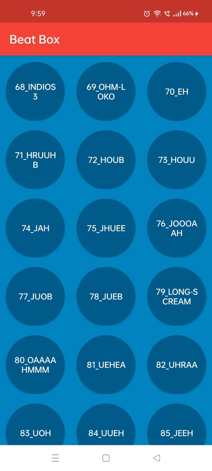
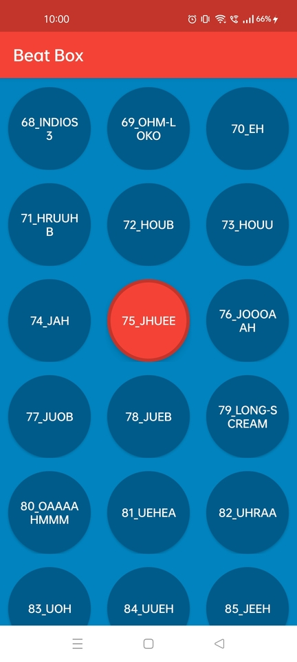

# Beat Box 

## Synopsis

Beat Box is not a box for musical beats. It is a box that helps you beat people up. It does not 
help with the easy part, though: the part where you wave your arms around dangerously, bruising 
and hurting another human being. It helps with the hard part: yelling in a manner calculated to 
frighten your opponent into submission.

## Table of Contents

> * [Title](#beat-box)
> * [Synopsis](#synopsis)
> * [Table of Contents](#table-of-contents)
> * [Features](#features)
> * [Installation Guide](#installation-guide)
> * [Preview](#preview)
> * [Resources](#resources)

## Features

* Mix sounds with a simple touch of your fingers.
* Play up to a maximum of five sounds at a time.
* Feel the UI along with the beat.

## Installation Guide

Clone the repository and import into Android Studio

```bash
https://github.com/AKSingh18/BeatBox.git
```

For a quick installation download the [apk](apk/app-debug.apk)

## Preview

A quick [demo](files/demo.mp4) video has also been added for preview. 

  

## Resources

* [Android Programming - The Big Nerd Ranch Guide](https://bignerdranch.com/books/android-programming-the-big-nerd-ranch-guide-4th-edition/)
* [Android Developers](https://developer.android.com/)
